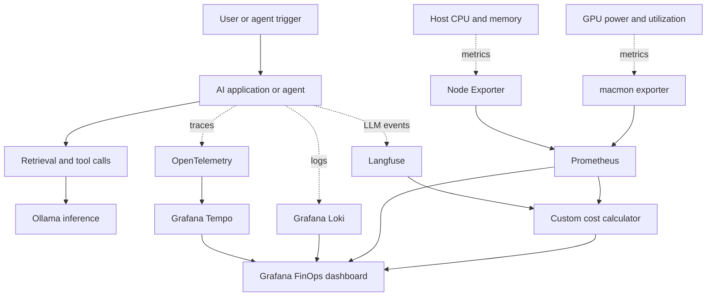
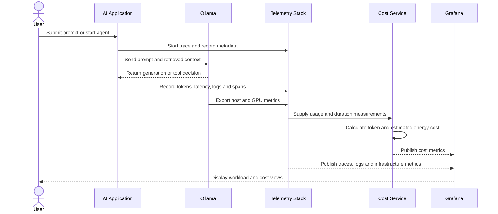

Overview:

Here is a simulated Finops + Observability solution for tracking AI workloads. The purpose of this solution is to build a cost and workload tracking dashboard for AI deployments in your organization. As soon as you run this solution, a trace will start tracking all your AI deployments. It will track every step your AI is making + calculating the costs of tokens by drilling down to the workloads happening in your datacenter. 

Here is the functional flow of how each of these data points is being collected - 

1) Start by using your AI, submit a prompt or run an Agent
2) A trace has begun, with details about every action your AI or Agent is taking
3) Retrieves context, request goes to LLM, LLM runs the model on GPU/Neural Engine
4) An AI generation or Agentic AI action is presented as the output, either user can submit an additional prompt or the next step in Agentic chain is auto executed
5) Metrics collected in parallel -
      Token usage & latency → OpenTelemetry + Langfuse
      CPU / Memory → Node Exporter
      GPU usage %, power (watts), temperature → macmon
7) Cost service calculates token costs and estimated energy cost (using GPU power draw × time)
8) Everything appears in FinOps Dashboard

Calculations:

Estimated Cost = (Token Cost) + (GPU Power × Duration × Electricity Rate) + (Memory Pressure Factor)

Sample token costs for input and outputs - 

Below are the tools I'm using:
1) Instrumentation - OpenTelemetry
2) Metrics Storage - Prometheus
3) Visualization - Grafana
4) CPU/Host Metrics - Prometheus Node Explorer
5) GPU Metrics: Macmon - Prometheus endpoint
6) Tracing - Grafana Tempo - Full journey of a request
7) Logs - Loki - Searches application logs
8) Orchestration - Docker Compose
9) Inference Engine - Ollama
10) LLM Observability - Langfuse - Deep observability for LLM prompts, costs, and quality
11) RAG Evaluation - RAGAS - Helps automatically test and score whether your RAG system is giving accurate, grounded, and useful answers.
12) Cost / FinOps - Custom Tool
13) Frontend - Streamlit

## Baseline Architecture

This repository currently documents a simulated reference architecture. The diagram below separates the AI workload, telemetry pipeline, cost calculation, and visualization layers that a full implementation would connect.

Architectural Flow:

Control and Deployment Boundaries

- Docker Compose is the proposed local orchestration boundary for Prometheus, Grafana, Tempo, Loki, Langfuse, Ollama, and supporting services.
- `macmon` remains outside Docker and exposes GPU-related metrics on TCP 9101.
- Node Exporter exposes host metrics on TCP 9100; Prometheus scrapes the configured exporters on TCP 9090.
- The cost formula is an estimate and should be labeled separately from provider-billed cost.
- No executable observability stack is currently checked into this repository; configuration files and application instrumentation remain implementation work.
